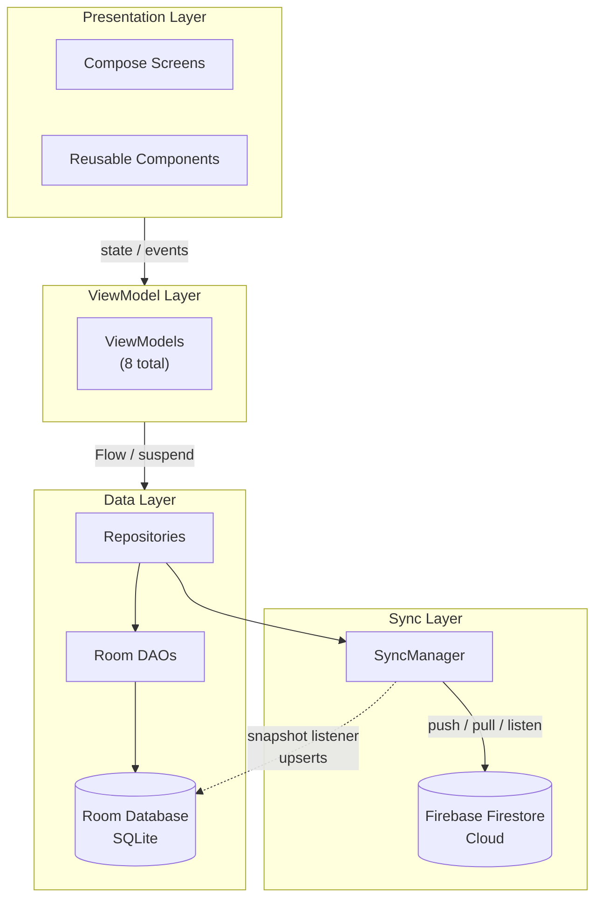

<p align="center">
  
</p>

<h1 align="center">Vaulti</h1>

<h3 align="center">Personal Finance Tracker</h3>

<p align="center">
  A modern, open-source finance tracker for Android built with Jetpack Compose, Material 3, and Firebase.
  <br />
  Local-first with optional real-time cloud sync.
</p>

<p align="center">
  <a href="#-features">Features</a> •
  <a href="#-getting-started">Getting Started</a> •
  <a href="#%EF%B8%8F-architecture">Architecture</a> •
  <a href="#-project-structure">Project Structure</a> •
  <a href="#-tech-stack">Tech Stack</a> •
  <a href="#-contributing">Contributing</a> •
  <a href="#-license">License</a>
</p>

<p align="center">
  
  
  
  
  
  
  
  
</p>

<br />

---

## ✨ Features

<table>
  <thead>
    <tr>
      <th width="180">Feature</th>
      <th>Description</th>
    </tr>
  </thead>
  <tbody>
    <tr>
      <td> <b>Multi-Account</b></td>
      <td>Track Cash, Bank, Credit Card, E-Wallet, Investment, and Other accounts with color-coded cards and archiving support.</td>
    </tr>
    <tr>
      <td> <b>Transactions</b></td>
      <td>Log expense, income, and transfer transactions with categories, notes, and dates. Sort and filter by date or amount.</td>
    </tr>
    <tr>
      <td> <b>Budgets</b></td>
      <td>Create weekly, monthly, or yearly budgets with real-time spending progress bars.</td>
    </tr>
    <tr>
      <td> <b>Goals</b></td>
      <td>Set savings targets with deadlines, track progress, and mark goals complete.</td>
    </tr>
    <tr>
      <td> <b>Categories</b></td>
      <td>Pre-defined categories plus fully customizable user-defined categories for transactions.</td>
    </tr>
    <tr>
      <td> <b>Dashboard</b></td>
      <td>Net worth overview, account carousel, monthly income vs. expense summary, and recent transactions at a glance.</td>
    </tr>
    <tr>
      <td> <b>Cloud Sync</b></td>
      <td>Optional Firebase Firestore sync keeps your data in real-time across devices. Local-first — your data always stays in Room.</td>
    </tr>
    <tr>
      <td> <b>Import / Export</b></td>
      <td>Backup and restore your entire financial data as JSON files.</td>
    </tr>
    <tr>
      <td> <b>Theme Support</b></td>
      <td>System, Light, and Dark mode support. Android 12+ dynamic color theming. Custom accent color palette.</td>
    </tr>
    <tr>
      <td> <b>Balance Hiding</b></td>
      <td>Toggle to quickly hide all monetary amounts for privacy in public spaces.</td>
    </tr>
  </tbody>
</table>

<br />

## 📱 Screenshots

<details>
  <summary>Click to expand screenshots (coming soon)</summary>
  <br />
  <p align="center">
    <i>Screenshots of the app will be added here once the UI is finalized. Stay tuned!</i>
  </p>

  <!-- When ready, use a table like this:
  <table>
    <tr>
      <td></td>
      <td></td>
      <td></td>
    </tr>
    <tr>
      <td align="center">Dashboard</td>
      <td align="center">Transactions</td>
      <td align="center">Accounts</td>
    </tr>
  </table>
  -->
</details>

<br />

## 🚀 Getting Started

### Prerequisites

- **Android Studio** Hedgehog (2023.1.1) or newer
- **JDK 17**
- **Android SDK** 34 (compileSdk) with platform tools
- A **Firebase project** with Authentication, Firestore, and Crashlytics enabled

### Firebase Setup

<ol>
  <li>
    <b>Create a Firebase project</b> at <a href="https://console.firebase.google.com">console.firebase.google.com</a>
  </li>
  <li>
    <b>Register your Android app</b> with package name <code>com.vaulti.app</code>
  </li>
  <li>
    <b>Download <code>google-services.json</code></b> and place it at <code>app/google-services.json</code>
  </li>
  <li>
    <b>Enable Authentication</b>: Email/Password and Google Sign-In under <i>Authentication &gt; Sign-in method</i>
  </li>
  <li>
    <b>Enable Firestore</b> under <i>Firestore Database &gt; Create database</i> (start in test mode, then configure security rules)
  </li>
  <li>
    <b>Add SHA-1 fingerprint</b> under <i>Project Settings &gt; Your apps &gt; Android</i> for Google Sign-In to work
  </li>
</ol>

<details>
  <summary><b>Firestore Security Rules</b> (recommended for production)</summary>

  ```javascript
  rules_version = '2';
  service cloud.firestore {
    match /databases/{database}/documents {
      match /users/{userId}/{document=**} {
        allow read, write: if request.auth != null && request.auth.uid == userId;
      }
    }
  }
  ```
</details>

### Google Sign-In Configuration

The app uses a Google web client ID for Sign-In. To configure yours:

1. Go to <a href="https://console.cloud.google.com/apis/credentials">Google Cloud Console → Credentials</a>
2. Create an OAuth 2.0 Client ID (Web application type)
3. Copy the client ID and update the <code>GOOGLE_WEB_CLIENT_ID</code> field in <code>app/build.gradle.kts</code>:

```kotlin
buildConfigField("String", "GOOGLE_WEB_CLIENT_ID", "\"YOUR_CLIENT_ID.apps.googleusercontent.com\"")
```

### Build & Run

```bash
# Clone the repository
git clone https://github.com/mntramos/Vaulti.git

# Open in Android Studio — let Gradle sync complete

# Build debug APK
./gradlew assembleDebug

# Build release APK (requires release.keystore)
./gradlew assembleRelease
```

> **Note:** The release build requires a keystore file. See <a href="#generating-a-release-build">Generating a Release Build</a> below.

<details>
  <summary><b>Generating a Release Build</b></summary>

  <p>The release build is configured with signing via <code>release.keystore</code> at the project root. To generate your own:</p>

  ```bash
  keytool -genkey -v -keystore release.keystore -alias vaulti -keyalg RSA -keysize 2048 -validity 10000
  ```

  <p>Set environment variables for the signing credentials:</p>

  ```bash
  export VAULTI_STORE_PASSWORD=your_store_password
  export VAULTI_KEY_ALIAS=vaulti
  export VAULTI_KEY_PASSWORD=your_key_password
  ```

  <p>If unset, the build falls back to <code>vaulti123</code> as a default (not recommended for production).</p>

  <p>Then:</p>

  ```bash
  ./gradlew assembleRelease
  # APK output: app/build/outputs/apk/release/Vaulti-v0.1.0-release.apk
  ```
</details>

<br />

## 🏗️ Architecture

Vaulti follows **MVVM + Clean Architecture** with a **local-first** data strategy.



### Data Flow

```
┌──────────────┐     ┌─────────────┐     ┌─────────────┐     ┌──────────────┐
│  User taps   │────▶│  ViewModel  │────▶│  Repository  │────▶│    Room DB   │
│  "Add"       │     │             │     │              │     │  (source of  │
│              │     │             │     │              │     │   truth)     │
└──────────────┘     └─────────────┘     └──────────────┘     └──────┬───────┘
                                                                     │
                                                                     ▼
                                                              ┌──────────────┐
                                                              │  SyncManager  │────▶ Firestore
                                                              │  (fire &      │      (cloud)
                                                              │   forget)     │
                                                              └──────────────┘
```

- **Local-first:** All writes go to Room DB first, then sync to Firestore asynchronously.
- **Real-time sync:** Firestore snapshot listeners upsert remote changes into Room automatically.
- **Offline-capable:** Room works offline; sync resumes when connectivity returns.

<br />

## 📂 Project Structure

<details>
  <summary><b>Click to expand the full project tree</b></summary>

  ```
  app/
  └── src/main/java/com/vaulti/app/
      ├── MainActivity.kt                    # Single-activity host, navigation graph
      ├── VaultiApplication.kt                # @HiltAndroidApp entry point
      │
      ├── di/
      │   └── AuthModule.kt                  # FirebaseAuth Hilt provider
      │
      ├── data/
      │   ├── database/
      │   │   ├── DatabaseModule.kt           # Room, Firestore, Repository DI
      │   │   ├── VaultiDatabase.kt           # Room database (v1, 5 tables)
      │   │   ├── dao/
      │   │   │   ├── AccountDao.kt
      │   │   │   ├── BudgetDao.kt
      │   │   │   ├── CategoryDao.kt
      │   │   │   ├── GoalDao.kt
      │   │   │   └── TransactionDao.kt
      │   │   └── entity/
      │   │       ├── Account.kt
      │   │       ├── AccountType.kt          # Enum: CASH, BANK, CREDIT, E_WALLET, INVESTMENT, OTHER
      │   │       ├── Budget.kt
      │   │       ├── BudgetPeriod.kt         # Enum: WEEKLY, MONTHLY, YEARLY
      │   │       ├── Category.kt
      │   │       ├── Goal.kt
      │   │       ├── RecurringInterval.kt    # Enum: DAILY, WEEKLY, MONTHLY, YEARLY
      │   │       ├── Transaction.kt
      │   │       └── TransactionType.kt      # Enum: EXPENSE, INCOME, TRANSFER
      │   ├── repository/
      │   │   ├── AccountRepository.kt
      │   │   ├── BudgetRepository.kt
      │   │   ├── CategoryRepository.kt
      │   │   ├── GoalRepository.kt
      │   │   └── TransactionRepository.kt
      │   └── sync/
      │       └── SyncManager.kt             # Firestore real-time sync engine
      │
      ├── viewmodel/
      │   ├── AccountViewModel.kt
      │   ├── AuthViewModel.kt
      │   ├── BudgetViewModel.kt
      │   ├── CategoriesViewModel.kt
      │   ├── DashboardViewModel.kt
      │   ├── GoalViewModel.kt
      │   ├── SettingsViewModel.kt
      │   └── TransactionViewModel.kt
      │
      └── ui/
          ├── Categories.kt                  # Default categories list
          ├── FormatUtils.kt                 # Currency, date formatting
          ├── components/
          │   ├── AccountCard.kt
          │   ├── BottomNavBar.kt
          │   └── TransactionItem.kt
          ├── screens/
          │   ├── AccountDetailScreen.kt
          │   ├── AccountsScreen.kt
          │   ├── AddTransactionScreen.kt
          │   ├── BudgetsScreen.kt
          │   ├── CategoriesScreen.kt
          │   ├── DashboardScreen.kt
          │   ├── GoalsScreen.kt
          │   ├── LoginScreen.kt
          │   ├── RegisterScreen.kt
          │   ├── SettingsScreen.kt
          │   ├── SortOrder.kt               # Sorting enums
          │   └── TransactionsScreen.kt
          └── theme/
              ├── Color.kt
              ├── Theme.kt
              ├── ThemeMode.kt               # SYSTEM, LIGHT, DARK + AppPreferences
              └── Type.kt
  ```
</details>

<br />

## 🛠 Tech Stack

| Category | Technology | Version |
|---|---|---|
| **Language** | Kotlin | 1.9.22 |
| **UI** | Jetpack Compose (BOM) | 2024.03.00 |
| **UI** | Material 3 (Material You) | — |
| **UI** | Navigation Compose | 2.7.6 |
| **Architecture** | MVVM + Clean Architecture | — |
| **DI** | Dagger Hilt | 2.50 |
| **Local DB** | Room (SQLite) | 2.6.1 |
| **Cloud DB** | Firebase Firestore | 32.7.0 |
| **Auth** | Firebase Authentication | 32.7.0 |
| **Auth** | Google Play Services Auth | 21.0.0 |
| **Crash Reporting** | Firebase Crashlytics | 32.7.0 |
| **Async** | Kotlin Coroutines | 1.7.3 |
| **Annotations** | Java Inject / Javax Inject | — |
| **Min SDK** | Android 8.0 (API 26) | — |
| **Target SDK** | Android 14 (API 34) | — |
| **Build** | Gradle with Kotlin DSL | 8.5 |
| **AGP** | Android Gradle Plugin | 8.2.2 |

<br />

## 🤝 Contributing

Contributions are welcome! Here's how to get started:

1. **Fork** the repository
2. Create a **feature branch**: `git checkout -b feature/your-feature`
3. **Commit** your changes (descriptive messages, please)
4. **Build** and verify: `./gradlew assembleDebug`
5. **Push** to your fork and open a **Pull Request**

### Guidelines

- Follow the existing code style and architecture patterns
- Write clear, meaningful commit messages
- Test your changes before submitting
- Keep pull requests focused — one feature or fix per PR
- For major changes, open an issue first to discuss

<br />

## 📄 License

<details>
  <summary><b>MIT License</b></summary>

  ```
  MIT License

  Copyright (c) 2024 Mark Ramos

  Permission is hereby granted, free of charge, to any person obtaining a copy
  of this software and associated documentation files (the "Software"), to deal
  in the Software without restriction, including without limitation the rights
  to use, copy, modify, merge, publish, distribute, sublicense, and/or sell
  copies of the Software, and to permit persons to whom the Software is
  furnished to do so, subject to the following conditions:

  The above copyright notice and this permission notice shall be included in all
  copies or substantial portions of the Software.

  THE SOFTWARE IS PROVIDED "AS IS", WITHOUT WARRANTY OF ANY KIND, EXPRESS OR
  IMPLIED, INCLUDING BUT NOT LIMITED TO THE WARRANTIES OF MERCHANTABILITY,
  FITNESS FOR A PARTICULAR PURPOSE AND NONINFRINGEMENT. IN NO EVENT SHALL THE
  AUTHORS OR COPYRIGHT HOLDERS BE LIABLE FOR ANY CLAIM, DAMAGES OR OTHER
  LIABILITY, WHETHER IN AN ACTION OF CONTRACT, TORT OR OTHERWISE, ARISING FROM,
  OUT OF OR IN CONNECTION WITH THE SOFTWARE OR THE USE OR OTHER DEALINGS IN THE
  SOFTWARE.
  ```
</details>

---

<p align="center">
  Built with ❤️ using Kotlin and Jetpack Compose
  <br />
  <a href="https://github.com/mntramos/Vaulti/issues">Report Bug</a> •
  <a href="https://github.com/mntramos/Vaulti/issues">Request Feature</a> •
  <a href="https://github.com/mntramos/Vaulti">GitHub</a>
</p>
